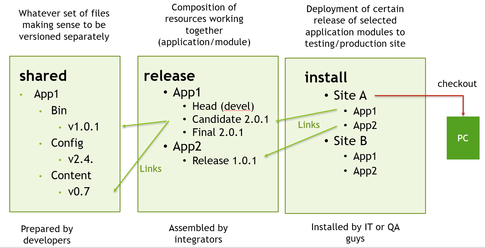

# Deployer

## Purpose

* Maintains a software project deployment structure in a SVN repository.

* Composes releases from different application modules from versioned components (shared resources). 

* Picks what to deploy on what site.

## Repository-oriented

Deployer works directly with a svn repository on the server.

Deployer can be started from wherever place having access to the svn server.

Deployer does not use any local working copies nor any other local data files. Everything is read from and stored to the repository on the server.

**Note:**
Everything what Deployer can do can be done manually as well by using standard subversion client operations manipulating with the repository.

Deployer just visualizes the repository structure in a human friendly way and makes repetitive operations easy (like creation of branch on many sub-repositories).

## Subversion versions supported

Deployer being a .net application uses SharpSvn2019 library to access the repository, supporting repository formats up to 12.

It was tested to work well with TortoiseSVN version 1.13.

## Modules, Releases and Installs

| Term    | Description                                                  |
| ------- | ------------------------------------------------------------ |
| Module  | For example an application that as part of a larger system, is having its own set data files in separate directory structure, independently on another modules. |
| Release | Composition of specific versions of different resources. For example a specific version of an  application (module). A specific release of a module can be linked to chosen installation sites. |
| Install | The selection of files as they appear on a computer on a concrete installation site. Composed of specific releases of one or more modules. |

## Repository Layout

The repository is expected to have the following structure:

* **shared**
  * whatever/component/folder/structure
    * trunk *<--- this is referenced from releases using externals*
  * whatever/component/folder/structure
    * trunk
  * etc...
* **releases**
  * <app module name>
    * head
      * Master   *<--- Here the externals to shared are placed. This is referenced from installs.*
    * integration
    * candidate
    * final
* **installs**
  * whatever/deployment/site
    * trunk *<--- Here the externals to releases are placed*

## Link types used

**HEAD** (trunk@HEAD)

* Follows the most recent state of the master branch (trunk)

* Ideal for development

**PEG** (trunk@revisionNo)

* Loosely pinned to a concrete revision, can receive latest changes (optional per-file)

* Enables easy commit of local changes back to trunk

* Good for integration

**BRANCH**

* Fixed to a concrete revision, can’t receive updates from trunk easily 

* Local changes do not affect trunk (merge necessary)

* Very safe, resistant to less skilled users, still allows for mods

* Good for QA testing

**TAG**

* Fixed to a concrete revision, does not allow for committing changes back

* Good for deployment to production sites

## Release types
Deployer recognizes the following predefined types of releases that differ in what link type they use.
 *  **head** ... uses HEAD externals
 *  **integration** ... uses PEG externals
 *  **candidate** ... uses BRANCH external
 *  **final** ... uses TAG externals

## New release creation
A new release is always created as a copy of an existing release. 

When creating the new release, the Deployer automatically creates necessary branches/tags subfolders  in all the resources referenced by externals.

## Linking a release of a module to an installation
Deployer supports easy linking of selected release to given installation.

1. Pick the installation you want to modify in the `Inastalls` box
2. Pick the module and its release you want to be linked to the installation in the `Releases` box
3. Press the `Link` button.
4. See the linked release version changing in the `App Modules Linked` window.

## No authentication handling

Deployer does not handle the authentication in any way.

It assumes the all the svn repositories used have been already accessed before using a svn client that has already cached all the credentials necessary. That applies to the main repository as well as to all repositories referenced using svn:externals links.

If authentication is still required for some repository, the Deployer most likely crashes with some authentication related exception dialog.

Resolution: use Tortoise SVN to connect to the repository and check "Remeber user name and password" when asked for credentials. Run Deployer again, this time it should be ok.

